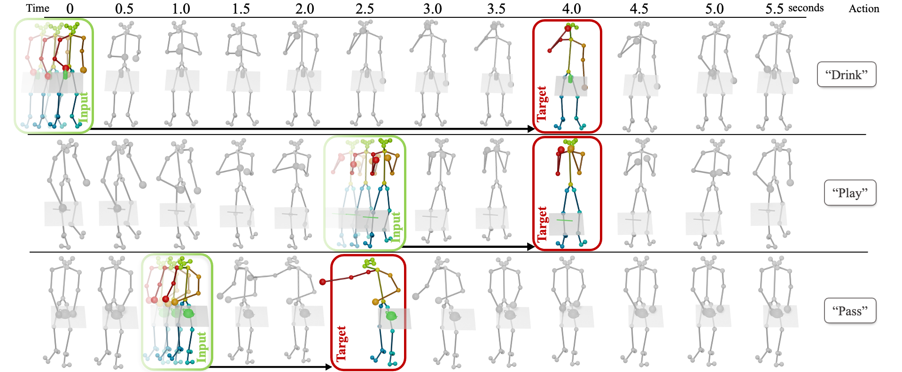

# Forecasting Characteristic 3D Poses of Human Actions (CVPR'22)

## 🌍 [Project Page](https://charposes.christian-diller.de/) | 📃 [Paper](https://charposes.christian-diller.de/characteristic3dposes.pdf) | 📝 [ArXiv](https://arxiv.org/abs/2011.15079) | 🎥 [Video](https://www.youtube.com/watch?v=kVhn8OWMgME)

 

> Forecasting Characteristic 3D Poses of Human Actions  
> [Christian Diller](https://www.christian-diller.de/), [Thomas Funkhouser](https://research.google/people/ThomasFunkhouser/), [Angela Dai](https://www.3dunderstanding.org/team.html)  
> Conference on Computer Vision and Pattern Recognition (CVPR), 2022

If you find this work useful for your research, please consider citing:

    @article{Diller2020ForecastingC3,
      title={Forecasting Characteristic 3D Poses of Human Actions},
      author={Christian Diller and Thomas A. Funkhouser and Angela Dai},
      journal={ArXiv},
      year={2020},
      volume={abs/2011.15079}
    }

    

## Abstract
We propose the task of forecasting characteristic 3d poses: from a short sequence observation of a person, predict a future 3d pose of that person in a likely action-defining, characteristic pose -- for instance, from observing a person picking up an apple, predict the pose of the person eating the apple.  
Prior work on human motion prediction estimates future poses at fixed time intervals.  Although easy to define, this frame-by-frame formulation confounds temporal and intentional aspects of human action.  Instead, we define a semantically meaningful pose prediction task that decouples the predicted pose from time, taking inspiration from  goal-directed behavior.    
To predict characteristic poses, we propose a probabilistic approach that models the possible multi-modality in the distribution of likely characteristic poses.    
We then sample future pose hypotheses from the predicted distribution in an autoregressive fashion to model dependencies between joints.    
To evaluate our method, we construct a dataset of manually annotated characteristic 3d poses.   
Our experiments with this dataset suggest that our proposed probabilistic approach outperforms state-of-the-art methods by 26% on average.

## Installation
1. Clone this repository   
`$ git clone https://github.com/chrdiller/characteristic3dposes; cd characteristic3dposes`

2. Initialize GRAB submodule   
`$ git submodule update --init --recursive`

3. Install python dependencies into a new virtual environment with [poetry](https://python-poetry.org)     
`$ poetry install`

4. Activate poetry environment  
`$ poetry shell`

## Datasets
### GRAB data
- Sign up on the [GRAB](https://grab.is.tue.mpg.de/) and [SMPL-X](https://smpl-x.is.tue.mpg.de/) websites
- On the GRAB website, download the "GRAB parameters" for all 10 subjects as well as subject shape templates for both female and male subjects
- On the SMPL-X website, download the SMPL-X model file ("Download SMPL-X v1.1")
- Move all 13 zip files into the directory `data_generation/grab/input`
- Extract all data  
`$ cd data_generation/grab/input/; bash extract.sh; cd ../../..`
- Run data generation script to extract characteristic poses  
`$ python data_generation/grab/generate_npz.py`

### Human3.6M data
- Sign up on the [Human3.6M](http://vision.imar.ro/human3.6m/) website
- Download "D3 Positions" for subjects S1, S5, S6, S7, S8, S9, and S10 (link appears after clicking on "Poses")
- Move all 7 zip files into the directory `data_generation/h36m/input`
- Extract all data  
`$ cd data_generation/h36m/input/; bash extract.sh; cd ../../..`
- Run data generation script to extract characteristic poses  
`$ python data_generation/h36m/generate_npz.py`

## Training
Run `$ bash train_grab.sh` to train on GRAB data or `$ bash train_h36m.sh` to train on Human3.6M data.  
All train configuration is located in `config.yaml` and will be parsed with hydra.

## Sampling, Refinement, Evaluation
### Sampling
To extract skeletons after training, run  
`$ python characteristic3dposes/sample.py -e grab`.  
Use parameter `-e grab` to sample a training on GRAB data, or `-e h36m` to sample a training on Human3.6M data.

### Refinement
To refine after training and sampling, run  
`$ python characteristic3dposes/refine.py -e grab -a -p 8` to refine GRAB predictions or  
`$ python characteristic3dposes/refine.py -e h36m -a -p 8` to refine Human3.6M predictions.

You might want to adapt the number of samples being processed in parallel to fit your machine (`-p` parameter).
Use parameter `-a` to refine all samples skeletons for each sample id or run refine without it to only refine the top-1 prediction. 

### Evaluation
To evaluate a the results after sampling and (optionally) refinement, run  
`$ python characteristic3dposes/evaluate.py -e grab -r` to evaluate GRAB predictions or  
`$ python characteristic3dposes/evaluate.py -e h36m -r` to evaluate Human3.6M predictions.

Use parameter `-r` to evaluate refined poses or run evaluate without it to evaluate unrefined predictions.

## License
Characteristic3DPoses is licensed under a Creative Commons Attribution-NonCommercial-ShareAlike 4.0 International License.

See LICENSE.txt for more details.
